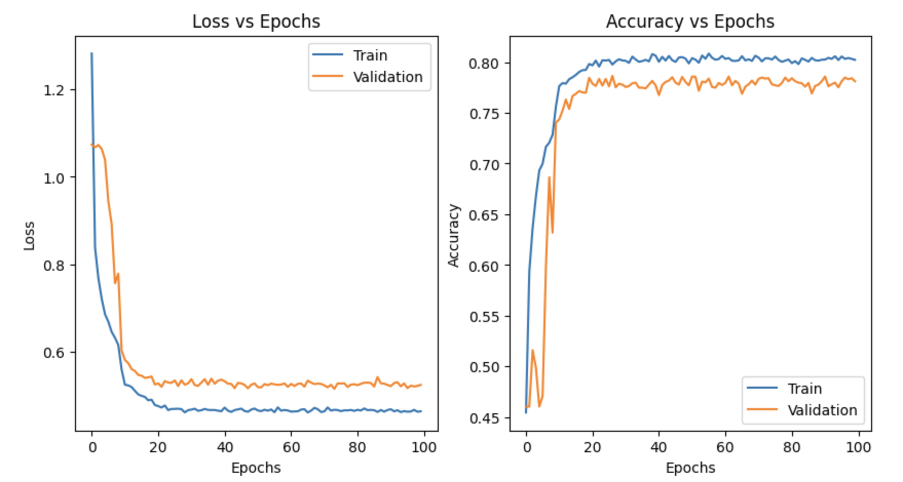

# Emotion-Driven Music Generation

In this project, we propose a deep learning pipeline for generating music based on emotional states of indivisuals. The pipeline consists of an Emotion Classification network based on EfficientNet, and a Music Generation model based on MIDINet. 

The emotion classification network identifies emotions from human facial images. The Music generation model then uses the classification label to generate piano roll melodies. We achieve an accuracy of 80.36\% on the Emotion Classifier for classifying to three emotions (happy, sad, or angry). Our Music Generator produces piano rolls that appear like traditional ones. However, our resulting melodies lack harmony and failed to evoke the intended emotional responses.

<h2> &nbsp;Model Architecture</h2>

<h4> &nbsp;Emotion Classifier</h4>

We use the pretrained EfficientNet model for our classification task. In our project we used EfficientNet-B0 model which is the baseline model in the EfficientNet family which utilizes depth-wise separable convolutions, squeeze-and-excitation blocks, and point-wise convolutions to efficiently capture features at different scales. The architecture of the EfficientNet-B0 can be depicted as below:

<h4> &nbsp;Melody Generator</h4>
The generator inputs a random noise vector z, conditional vector y, and the previous 4-bar piano roll. The noise vector passes through two fully connected layers. Afterward, the outputs are reshaped to an 8-by-1 vector. This follows a series of four transposed convolutional layers. Likewise, the previous piano roll passes through four convolutional layers, and the conditional components of the matching dimensions are concatenated at each layer. The final output goes through a sigmoid activation function to obtain a piano roll-like image. The discriminator has two convolutional layers followed by two fully connected layers. The last fully connected layer returns a single output, which goes through a sigmoid activation function representing the 'authenticity' of the input piano roll. 
The architecture of the Generator model can be depicted as below:

<h2> &nbsp;Results</h2>

In our final pipeline, we first import the emotion classifier that we previously trained and pass an image of a facial expression as the input to get the corresponding emotion as the output. Next, the output of the Emotion Classifier is mapped directly to the arousal-valence label. A random 4-bar starting melody is sampled from the label and used as the precursor melody to the GAN. The GAN generates a 4-bar melody, which becomes the next precursor melody to the GAN; this is repeated three times to obtain a 16-bar melody. We only take the top four pitches at each time step to match the melodies from the dataset. The melody is then exported as a MIDI file. The results of the generated audio can be found in the Generated Audio Results folder.

The evolution of loss and accuracy throughout the 100 epochs for both train and validation sets:

The results for the emotion classifier can be depicted as:

The generated melodies from the trained generator. The first bar is sampled randomly based on the given emotion label, and the subsequent bars are generated:

We also trained our generator by directly using the pretrained EMOPIA transformer. This version performs better in creating melodious songs that contain a certain genre of emotion. The audio reults from this generator can be found in the Emopia Results folder.
